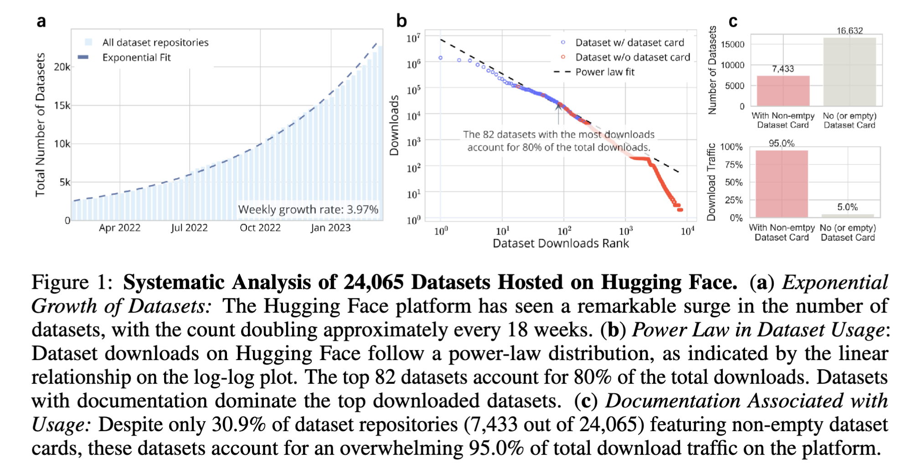
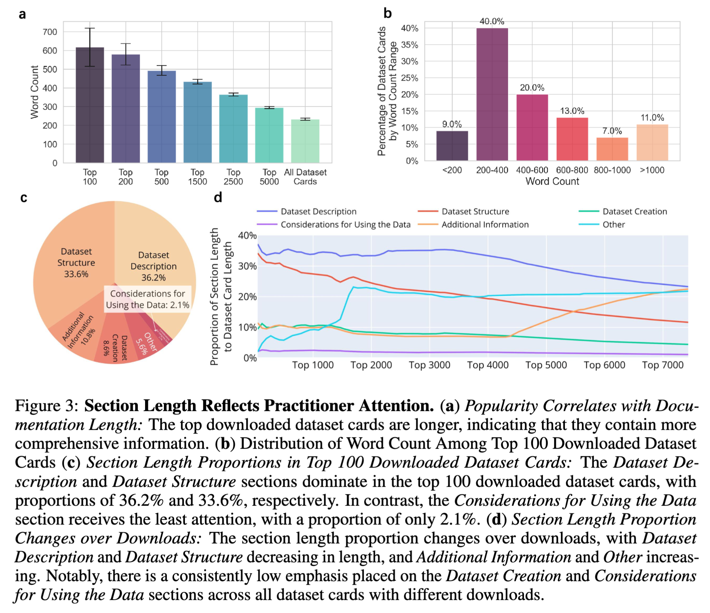

# Navigating Dataset Documentations in AI: A Large-Scale Analysis of Dataset Cards on HuggingFace (ICLR 2024)

[](https://lbesson.mit-license.org/)
[](https://openreview.net/forum?id=xC8xh2RSs2&noteId=dTUqhKV1ON)
[](https://www.python.org/downloads/release/python-3100/)
[](https://jupyter.org/try)

This repository contains the data and analysis code of our paper:

> [Navigating Dataset Documentations in AI: A Large-Scale Analysis of Dataset Cards on HuggingFace](https://openreview.net/forum?id=xC8xh2RSs2&noteId=dTUqhKV1ON) <br>
> Xinyu Yang\*, Weixin Liang\*, James Zou <br>
> ICLR 2024

## Repo Structure Overview

```plain
.
├── README.md
├── requirements.txt
├── Data/
    ├── Dataset_Card/ 
        ├── 0Tick_Danbooru-Random-Posts-Scrape.md
        ├── ...
    ├── Dataset_Info
        ├── dataset_info.parquet
        ├── datasetcard_info.parquet
        ├── datasetcard_sections_info.parquet
├── Scripts/
    ├── preprocess
    	├── process_datasetcard.py
    	├── util.py
    ├── HuggingFace_Hub_API.ipynb
    ├── Dataset_Overview.ipynb
    ├── Dataset_Card_Analysis.ipynb
├── Figures/
    ├── ...
```

We organized the repo as the above structure. It provides the dataset cards, together with the extracted meta-data (e.g., number of downloads, textual analyses) and our analysis codes of [Hugging Face Dataset Cards](https://huggingface.co/docs/hub/datasets-cards).

## Abstract

*Advances in machine learning are closely tied to the creation of datasets. While data documentation is widely recognized as essential to the reliability, reproducibility, and transparency of ML, we lack a systematic empirical understanding of current dataset documentation practices. To shed light on this question, here we take Hugging Face -- one of the largest platforms for sharing and collaborating on ML models and datasets --  as a prominent case study. By analyzing all 7,433 dataset documentation on Hugging Face, our investigation provides an overview of the Hugging Face dataset ecosystem and insights into dataset documentation practices, yielding 5 main findings: (1) The dataset card completion rate shows marked heterogeneity correlated with dataset popularity: While 86.0% of the top 100 downloaded dataset cards fill out all sections suggested by Hugging Face community, only 7.9% of dataset cards with no downloads complete all these sections. (2) A granular examination of each section within the dataset card reveals that the practitioners seem to prioritize the Dataset Description and Dataset Structure sections, accounting for 36.2% and 33.6% of the total card length, respectively, for the most downloaded datasets. In contrast, the Considerations for Using the Data section receives the lowest proportion of content, accounting for just 2.1% of the text. (3) By analyzing the subsections within each section and utilizing topic modeling to identify key topics, we uncover what is discussed in each section, and underscore significant themes encompassing both technical and social impacts, as well as limitations within the Considerations for Using the Data section. (4) Our findings also highlight the need for improved accessibility and reproducibility of datasets in the Usage sections. (5) In addition, our human annotation evaluation emphasizes the pivotal role of comprehensive dataset content in shaping individuals' perceptions of a dataset card's overall quality. Overall, our study offers a unique perspective on analyzing dataset documentation through large-scale data science analysis and underlines the need for more thorough dataset documentation in machine learning research.*

**TL;DR**: We conducted a comprehensive large-scale analysis of 7,433 ML dataset documentation on Hugging Face and uncovered the current practices and challenges of dataset documentation.

## Dependencies

> Dependencies are listed in `requirements.txt`. Note that due to the version compatibility issue, we recommend using
>
> * huggingface_hub 0.13.0: for fetching the dataset cards from Hugging Face ([document](https://huggingface.co/docs/huggingface_hub/package_reference/hf_api))
> * mistune 2.0.4: for parsing the markdown files ([document](https://mistune.lepture.com/en/latest/))
>
> otherwise the code may need to be modified accordingly.
>
> To install the dependencies, run the following commands:

```
conda create -n hf_datasetcard python=3.10
conda activate hf_datasetcard
pip install -r requirements.txt
```

## Data

The `Data` folder provides the data of 7,433 dataset cards on Hugging Face platform we analyzed, as well as the meta-data all the datasets and the dataset cards.

- The `Dataset_Card` folder stores 7,433 dataset cards we used to analyze.

  > To avoid conflicts with the '/' character, which is commonly used as a path separator, we replace it with '_' when creating the filename for a dataset card. This allows us to split the author name and dataset name for better organization. For example, the dataset card for `facebook/flores` will be saved as `facebook_flores.md`.
  >
- The `Dataset_Info` folder stores the dataset and dataset card information with the meta-data we extracted.

  - `dataset_info.parquet` stores the metadata we extracted of the 24,065 datasets as of Mar 16th, 2023. The metadata include the creation time, author, downloads, whether the dataset has a (non-empty) dataset card, the task category, and the task domain of the dataset.
    
  - `datasetcard_info.parquet` stores the information we extracted of the 7,433 dataset cards. The information include the dataset name, author, creation time, number of downloads, task category, task domain, content ot the dataset card, total word count, and whether the dataset card follows the template.
    
  - `datasetcard_sections_info.parquet` stores the information of the sections of the dataset cards. The sections include Dataset Description, Dataset Structure, Dataset Creation, Considerations for Using the Data, Additional Information. For each section, we provide whether a dataset card has this section (and whether it's empty), the subsections of the section, section length proportion of the section, the content of the section, and the word count of the section.
    

## Scripts

The `Scripts` folder provides the preprocess code and the analysis code.

### Preprocess

The `preprocess` folder provides the code to preprocess the dataset cards, parse the markdown-formatted dataset cards, and extract the meta-data of the dataset cards. It generates the information of each section of the dataset cards, including *whether a dataset card has this section (and whether it's empty), the subsections of the section, section length proportion of the section, the content of the section, and the word count of the section*. This information is already stored in `Data/Dataset_Info/datasetcard_sections_info.parquet`. To reproduce the results, run the following commands:

```
python process_datasetcard.py
```

### Analysis

The notebooks in the `Scripts` folder provide the analysis code to reproduce the results in our paper.

- `HuggingFace_Hub_API.ipynb` provides instructions on how to get access to the data using Hugging Face API.
- `Dataset_Overview.ipynb` provides analysis of the overview of dataset community of Hugging Face.
  
- `Dataset_Card_Analysis.ipynb` provides analysis of the dataset cards.
  
  
